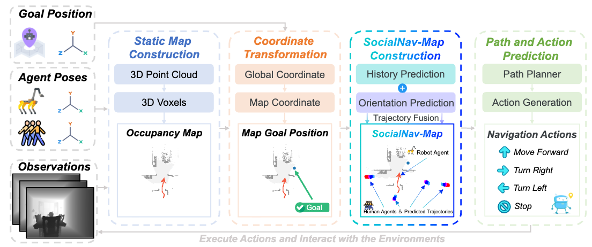

# SocialNav-Map: Dynamic Mapping with Human Trajectory Prediction for Zero-Shot Social Navigation
Repository for **SocialNav-Map: Dynamic Mapping with Human Trajectory Prediction for Zero-Shot Social Navigation**

Social navigation in densely populated dynamic
environments poses a significant challenge for autonomous mo-
bile robots, requiring advanced strategies for safe interaction.
Existing reinforcement learning (RL)-based methods require
over 2000+ hours of extensive training and often struggle to
generalize to unfamiliar environments without additional fine-
tuning, limiting their practical application in real-world scenar-
ios. To address these limitations, we propose SocialNav-Map,
a novel zero-shot social navigation framework that combines
dynamic human trajectory prediction with occupancy mapping,
enabling safe and efficient navigation without the need for
environment-specific training. Specifically, SocialNav-Map first
transforms the task goal position into the constructed map co-
ordinate system. Subsequently, it creates a dynamic occupancy
map that incorporates predicted human movements as dynamic
obstacles. The framework employs two complementary methods
for human trajectory prediction: history prediction and orien-
tation prediction. By integrating these predicted trajectories
into the occupancy map, the robot can proactively avoid
potential collisions with humans while efficiently navigating to
its destination. Extensive experiments on the Social-HM3D and
Social-MP3D datasets demonstrate that SocialNav-Map signifi-
cantly outperforms state-of-the-art (SOTA) RL-based methods,
which require 2,396 GPU hours of training. Notably, it reduces
human collision rates by over 10% without necessitating any
training in novel environments. By eliminating the need for
environment-specific training, SocialNav-Map achieves superior
navigation performance, paving the way for the deployment of
social navigation systems in real-world environments charac-
terized by diverse human behaviors. 



## Getting Started

#### 1. **Preparing conda env**

Assuming you have [conda](https://docs.conda.io/projects/conda/en/latest/user-guide/install/) installed, let's prepare a conda env:
```
conda_env_name=socialnav-map
conda create -n $conda_env_name python=3.9 cmake=3.14.0
conda activate $conda_env_name
```

#### 2. **conda install habitat-sim & habitat-lab**
Following [Habitat-lab](https://github.com/facebookresearch/habitat-lab.git)'s instruction:
```
conda install habitat-sim=0.3.1 withbullet headless -c conda-forge -c aihabitat
```

If you encounter network problems, you can manually download the Conda package from [this link](https://anaconda.org/aihabitat/habitat-sim/0.3.1/download/linux-64/habitat-sim-0.3.1-py3.9_headless_bullet_linux_3d6d67d6deae4ab2472cc84df7a3cef1503f606d.tar.bz2) to download the conda bag, and install it via: `conda install --use-local /path/to/xxx.tar.bz2` to download.

Then, assuming you have this repositories cloned (forked from Habitat 3.0), install necessary dependencies of Habitat.
```
cd Falcon
pip install -e habitat-lab
pip install -e habitat-baselines
pip install -r requirements.txt # install other dependencies
```

For other dependencies, see socialnav-map.yaml.


#### 3. **Downloading the Social-HM3D & Social-MP3D datasets**

- Download Scene Datasets

Following the instructions for **HM3D** and **MatterPort3D** in Habitat-lab's [Datasets.md](https://github.com/facebookresearch/habitat-lab/blob/main/DATASETS.md).

- Download Episode Datasets

Download social navigation (SocialNav) episodes for the test scenes, which can be found here: [Link](https://drive.google.com/drive/folders/1V0a8PYeMZimFcHgoJGMMTkvscLhZeKzD?usp=drive_link).

After downloading, unzip and place the datasets in the default location:
```
unzip -d data/datasets/pointnav
```
- Download Leg animation

```
wget https://github.com/facebookresearch/habitat-lab/files/12502177/spot_walking_trajectory.csv -O data/robots/spot_data/spot_walking_trajectory.csv
```

- Download Multi-agent necessary data

```
python -m habitat_sim.utils.datasets_download --uids hab3-episodes habitat_humanoids hab3_bench_assets hab_spot_arm
```

The file structure should look like this:

```
SocialNav-Map/
└── Falcon/
└── socialnav-map/
    └── data/
        ├── datasets
        │   └── pointnav
        │       ├── social-hm3d
        │       │   ├── train
        │       │   │   ├── content
        │       │   │   └── train.json.gz
        │       │   └── val
        │       │       ├── content
        │       │       └── val.json.gz
        │       └── social-mp3d
        │           ├── train
        │           │   ├── content
        │           │   └── train.json.gz
        │           └── val
        │               ├── content
        │               └── val.json.gz
        ├── scene_datasets
        ├── robots
        ├── humanoids
        ├── versoned_data
        └── hab3_bench_assets
```

## For Evaluation

```
cd socialnav-map
python socialmap_hm3d.py --split val --eval 1 --auto_gpu_config 0 -n 1 --num_eval_episodes 400  --num_local_steps 10 --print_images 1  --exp_name ronghe_0.1 --eval_episodes 1087 --collect 0 --stop_th 494
```

## Acknowledgement

Our code is modified from [InstructNav](https://github.com/LYX0501/InstructNav) and [Falcon](https://raw.githubusercontent.com/Zeying-Gong/Falcon/65b88ccc7218190a24564d5ea3d989895c25b2c3/).
Thanks for their open-set work.

## BibTex
Please cite our paper if you find it helpful :)
```
@article{zhang2025socialnav,
  title={SocialNav-Map: Dynamic Mapping with Human Trajectory Prediction for Zero-Shot Social Navigation},
  author={Zhang, Lingfeng and Xiao, Erjia and Hao, Xiaoshuai and Fu, Haoxiang and Gong, Zeying and Chen, Long and Liang, Xiaojun and Xu, Renjing and Ye, Hangjun and Ding, Wenbo},
  journal={arXiv preprint arXiv:2511.12232},
  year={2025}
}
```
